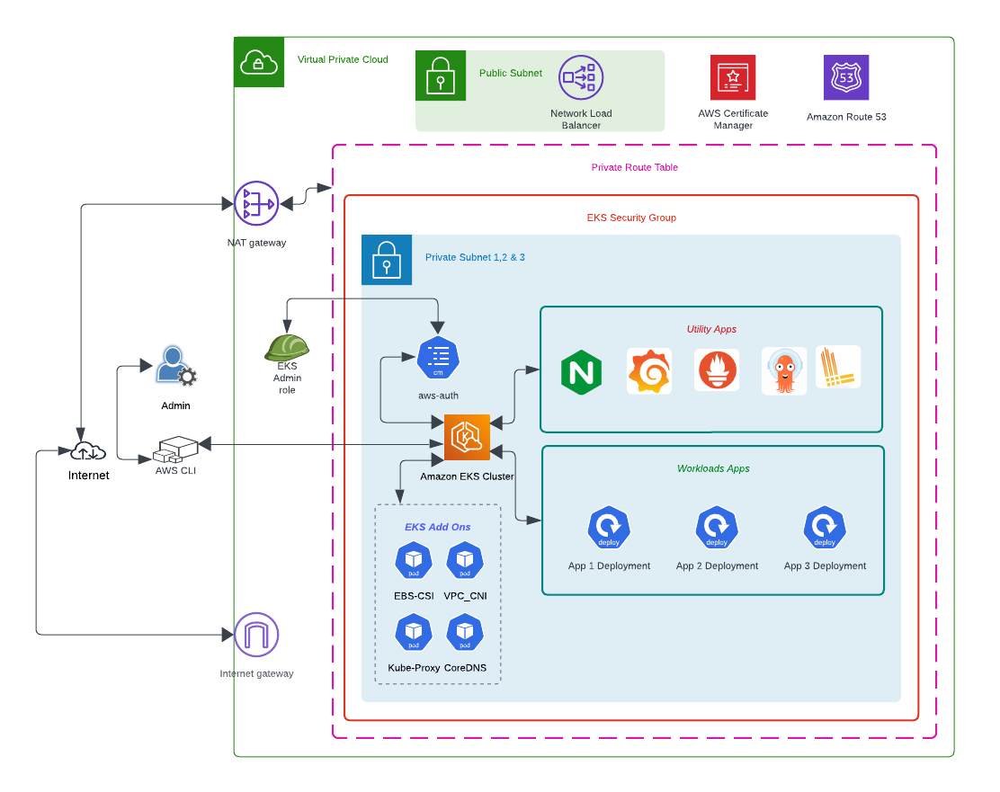

# AWS EKS Complete Infrastructure project

In this project use Terraform to completely deploy an AWS EKS cluster with ArgoCD, Grafana, Prometheus and Loki. From Tools and technologies perspective Terraform, EKS, GitHub, GitHub Actions, Kuberenetes, Kustomize and Helm are used.

## Following activities will be completed through the Automated pipeline.

### 1. AWS Network component provisioning with Terraform
Resources: VPC, Internet Gateway, Nat Gateway, Route Tables, Subnets, Security Groups, Elastic IP
### 2. Provision AWS EKS cluster with node groups and other components with Terraform
Resources: IAM role with Minimum access, KMS for Cluster encyption, EKS Cluster, Kubernetes OIDC provider, IAM role for the Node Group, Node Groups, EKS Addon
### 3. Install ArgoCD for GitOps based deployment 
Resources: Use Helm to deploy the ArgoCD helm chart via Terraform
### 4. Install and Configure Nginx Ingress Controller
Resources: Use helm and Terraform to deploy Kubernetes Nginx Ingress Controller
### 5. Install Monitoring application Prometheus, Loki and Grafana
Resources: Use Helm and Terraform to deploy Prometheus, Loki and Grafana
### 6. Apply Ingress to access ArgoCD GUI, Grafana GUI and Prometheus
Resources: Use kubectl tool to apply Ingress rules to provide access to GUI component. Kustomize also used so we cna deploy the same ingress based on different environement.

## Architecture

High Level architecture

EKS Internal components

### Best Practices used

1. Use Open ID Connect to communicate with AWS
    Configure GitHub Project with OIDC connection with AWS  This is one of the most secure methods to communicate AWS by configuring the GitHub Identity provider in AWS IAM. It reduces the credential overhead and possible security concerns.

To be Continued

----------- Drafts -----------------
1. Apply the Terraform code to create the infrastructure
    This will create the EKS cluster. @ node Groups and Some AddOns such as CNI, CoreDN and kube-proxy

2. Run the command to configure the AWS CLI command for the "kubectl"
    #aws eks --region ap-south-1 update-kubeconfig --name EKS-GitOps-Cluster

3. Now need to install the Nginx-Ingress controller
    "https://github.com/kubernetes/ingress-nginx/tree/main/charts/ingress-nginx"

    #helm repo add ingress-nginx https://kubernetes.github.io/ingress-nginx
    #helm repo update
    ###########helm install eks-ingress-nginx ingress-nginx/ingress-nginx
    #kubectl create ns ingress-nginx
    #helm install ingress-nginx ingress-nginx \
        --repo https://kubernetes.github.io/ingress-nginx \
        --namespace ingress-nginx \
        --set controller.metrics.enabled=true \
        --set-string controller.podAnnotations."prometheus\.io/scrape"="true" \
        --set-string controller.podAnnotations."prometheus\.io/port"="10254

4. Create sample deployment and sxpose using clusterip service
    Create deployment
    #kubectl create deploy dep1 --image=httpd --replicas=2 --port=80
    Expose deployment with service
    #kubectl expose deploy dep1 --name=my-svc --port=80 --target-port=80

5. Create Ingress Rule
    Rule will direct the traffic to "my-svc" and service will direct to one of the pods
    '''
        apiVersion: networking.k8s.io/v1
        kind: Ingress
        metadata:
        name: minimal-ingress
        annotations:
            nginx.ingress.kubernetes.io/rewrite-target: /
        spec:
        ingressClassName: nginx
        rules:
        - http:
            paths:
            - path: /testpath
                pathType: Prefix
                backend:
                service:
                    name: my-service
                    port:
                    number: 80

6. Install Promethius and Grafana

    Pre-requisites
    1. Make sure we have the Storage class with proper driver is in place.
        I added the "aws-ebs-csi-driver" add on via Terraform 
    2. We should have provided the access to the NodeGroup with "AmazonEBSCSIDriverPolicy"(arn:aws:iam::aws:policy/service-role/AmazonEBSCSIDriverPolicy)
        Reference: https://www.reddit.com/r/Terraform/comments/znomk4/ebs_csi_driver_entirely_from_terraform_on_aws_eks/
        Added as Terraform resource.
    3. Now install the Prometheus
        Reference: https://docs.aws.amazon.com/eks/latest/userguide/prometheus.html
        # kubectl create namespace prometheus
        # helm repo add prometheus-community https://prometheus-community.github.io/helm-charts
        # helm repo update prometheus-community
        # helm install my-prometheus prometheus-community/prometheus --namespace prometheus --values prometheus/values.yaml
        ## helm install prom prometheus-community/kube-prometheus-stack --namespace prometheus
        # helm upgrade -i my-prometheus prometheus-community/prometheus \
            --namespace prometheus \
            --set alertmanager.persistentVolume.storageClass="gp2",server.persistentVolume.storageClass="gp2"